# Updated UML Class Diagram (Current Kotlin MVP)

```mermaid
classDiagram
    direction LR

    class UseLog {
      +String id
      +Instant timestamp
      +String? feelingNote
      +LogSource source
    }

    class LogSource {
      <<enum>>
      BUTTON
      MANUAL
    }

    class RewardTier {
      +String id
      +String label
      +Long unlockMinutesRequired
    }

    class RewardPrize {
      +String id
      +String tierId
      +String label
      +Int pointCost
    }

    class PointTransaction {
      +String id
      +Instant timestamp
      +Int amount
      +String reason
    }

    class LapsePreview {
      +Instant now
      +Instant? lastRecordedUse
      +Long elapsedMinutes
      +Int pointsToAward
      +Set~String~ projectedUnlockTierIds
    }

    class PetState {
      +String name
      +String mood
      +Set~String~ unlockedRewardIds
    }

    class TrackerRepository {
      <<interface>>
      +StateFlow~List~UseLog~~ useLogs
      +StateFlow~Int~ currentStreakPoints
      +StateFlow~Int~ lifetimePoints
      +StateFlow~Int~ bankedPoints
      +StateFlow~PetState~ petState
      +StateFlow~List~RewardTier~~ rewardTiers
      +StateFlow~List~RewardPrize~~ rewardPrizes
      +buildLapsePreview(now: Instant) LapsePreview
      +logLapse(feelingNote: String?, confirmLastUseAccurate: Boolean) Unit
      +addManualLog(timestamp: Instant, feelingNote: String?, pointAdjustment: Int) Unit
      +spendPoints(prizeId: String) Unit
    }

    class InMemoryTrackerRepository {
      -TrackerEngine trackerEngine
      -MutableStateFlow~List~PointTransaction~~ transactions
      +buildLapsePreview(now: Instant) LapsePreview
      +logLapse(feelingNote: String?, confirmLastUseAccurate: Boolean) Unit
      +addManualLog(timestamp: Instant, feelingNote: String?, pointAdjustment: Int) Unit
      +spendPoints(prizeId: String) Unit
      -refreshTotals(now: Instant, includePendingWindowForUnlocks: Boolean) Unit
    }

    class TrackerEngine {
      +pointsEarnedFromDelay(previousUse: Instant?, newUse: Instant) Int
      +pointsForMinutes(minutes: Long) Int
      +maxDelayMinutes(logs: List~UseLog~) Long
      +unlockedTierIdsFromMaxDelay(maxDelayMinutes: Long) Set~String~
      +computeTotalEarnedPoints(logs: List~UseLog~) Int
      +projectedUnlockedTierIds(logs: List~UseLog~, now: Instant, includeCurrentPendingWindow: Boolean) Set~String~
    }

    class TrackerUiState {
      +Long elapsedMinutesSinceLastUse
      +Int currentStreakPoints
      +Int lifetimePoints
      +Int bankedPoints
      +List~UseLog~ logs
      +List~RewardTier~ rewardTiers
      +List~RewardPrize~ rewardPrizes
      +Set~String~ unlockedRewardTierIds
      +String feelingNoteDraft
      +Boolean confirmLastUseAccurate
      +Instant? lastRecordedUse
      +Int projectedPointsOnLapse
      +String manualTimestampDraft
      +String manualPointsAdjustmentDraft
    }

    class TrackerViewModel {
      +onNoteDraftChanged(value: String) Unit
      +onConfirmLastUseAccurateChanged(value: Boolean) Unit
      +onManualTimestampDraftChanged(value: String) Unit
      +onManualPointsDraftChanged(value: String) Unit
      +onLogLapseClicked() Unit
      +onAddManualLogClicked() Unit
      +onSpendPrizeClicked(prizeId: String) Unit
    }

    class TrackerScreen {
      <<Composable>>
      +TrackerScreen(...callbacks...)
    }

    TrackerRepository <|.. InMemoryTrackerRepository
    InMemoryTrackerRepository --> TrackerEngine : uses
    InMemoryTrackerRepository --> UseLog : stores
    InMemoryTrackerRepository --> PointTransaction : stores
    InMemoryTrackerRepository --> RewardTier : catalogs
    InMemoryTrackerRepository --> RewardPrize : catalogs
    InMemoryTrackerRepository --> PetState : stores

    TrackerEngine --> UseLog : reads intervals
    TrackerEngine --> RewardTier : evaluates unlocks

    TrackerViewModel --> TrackerRepository : depends on
    TrackerViewModel --> TrackerUiState : emits
    TrackerUiState --> UseLog : contains
    TrackerUiState --> RewardTier : contains
    TrackerUiState --> RewardPrize : contains

    TrackerScreen --> TrackerUiState : renders
    TrackerScreen ..> TrackerViewModel : callbacks to actions
```

## Notes

- Reward **tiers** unlock by time-between-lapses duration, not by points.
- Reward **prizes** are bought with banked points and can have increasing costs per tier.
- Manual entries can add historical lapse logs and apply positive/negative point adjustments.
- Unlocks persist permanently via unioning into `PetState.unlockedRewardIds`.
