# Updated UML Class Diagram (Current Kotlin MVP)

```mermaid
classDiagram
    direction LR

    class UseLog {
      +Instant timestamp
      +String? feelingNote
    }

    class RewardTier {
      +String id
      +String label
      +Int pointsRequired
    }

    class PetState {
      +String name
      +String mood
      +Set~String~ unlockedRewardIds
    }

    class TrackerRepository {
      <<interface>>
      +StateFlow~List~UseLog~~ useLogs
      +StateFlow~Int~ currentStreakPoints
      +StateFlow~Int~ lifetimePoints
      +StateFlow~PetState~ petState
      +logLapse(feelingNote: String?) Unit
    }

    class InMemoryTrackerRepository {
      -List~RewardTier~ rewardTiers
      -TrackerEngine trackerEngine
      +StateFlow~List~UseLog~~ useLogs
      +StateFlow~Int~ currentStreakPoints
      +StateFlow~Int~ lifetimePoints
      +StateFlow~PetState~ petState
      +logLapse(feelingNote: String?) Unit
    }

    class TrackerEngine {
      -List~RewardTier~ rewardTiers
      +pointsEarnedFromDelay(previousUse: Instant?, newUse: Instant) Int
      +newlyUnlockedRewardIds(lifetimePoints: Int, alreadyUnlockedIds: Set~String~) Set~String~
    }

    class TrackerUiState {
      +Long elapsedMinutesSinceLastUse
      +Int currentStreakPoints
      +Int lifetimePoints
      +List~UseLog~ logs
      +String? lastFeelingNote
      +String feelingNoteDraft
      +Int unlockedRewardCount
    }

    class TrackerViewModel {
      -TrackerRepository repository
      -MutableStateFlow~Instant~ nowTick
      -MutableStateFlow~String~ noteDraft
      +StateFlow~TrackerUiState~ uiState
      +onNoteDraftChanged(value: String) Unit
      +onLogLapseClicked() Unit
    }

    class TrackerScreen {
      <<Composable>>
      +TrackerScreen(state: TrackerUiState, onNoteChanged: (String)->Unit, onLogLapseClick: ()->Unit, modifier: Modifier)
    }

    TrackerRepository <|.. InMemoryTrackerRepository
    InMemoryTrackerRepository --> TrackerEngine : uses
    InMemoryTrackerRepository --> UseLog : stores
    InMemoryTrackerRepository --> PetState : stores
    InMemoryTrackerRepository --> RewardTier : defines tiers

    TrackerEngine --> RewardTier : reads rules

    TrackerViewModel --> TrackerRepository : depends on
    TrackerViewModel --> TrackerUiState : emits
    TrackerUiState --> UseLog : contains

    TrackerScreen --> TrackerUiState : renders
    TrackerScreen ..> TrackerViewModel : callbacks to actions
```

## Notes

- `TrackerScreen` is represented as a composable function, not a stateful class in Kotlin source.
- `TrackerViewModel` produces `TrackerUiState` by combining repository flows with a timer tick and note draft flow.
- Progress behavior in `InMemoryTrackerRepository.logLapse`:
  - current streak points reset on lapse
  - lifetime points continue accumulating
  - unlocked reward IDs persist
